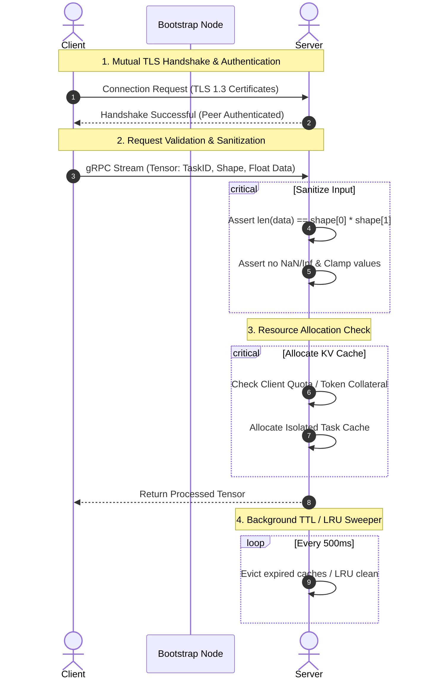

# Calyx Security Architecture: Securing Decentralized P2P LLM Networks

In a fully decentralized P2P network like **Calyx**, where clients and servers are owned by untrusted third parties, security is a bi-directional necessity:
1. **Servers must be protected from malicious clients** trying to hijack resources, poison caches, crash nodes, or mount Denial of Service (DoS) attacks.
2. **Clients must be protected from malicious/compromised servers** attempting to steal prompts (input leaks), poison model outputs, or inject malicious payloads.

This document outlines a multi-layered security blueprint to guarantee trust and safety across the Calyx network.

---

## 1. Transport Security & Network Isolation

Without secure transport, the network is vulnerable to Man-in-the-Middle (MitM) attacks, packet tampering, and sniffing of sensitive weights/prompt activations.

### Mutual TLS (mTLS) with TLS 1.3
* **Implementation**: Standardize all gRPC streaming on **mTLS**. 
* **Mechanism**: Both the client and server must present cryptographic certificates signed by a trusted Certificate Authority (CA) or validated via a decentralized trust chain (e.g., identity keys logged in the Bootstrap/DHT registry).
* **Benefit**: Guarantees encryption of prompts/activations in transit and authenticates the identity of every peer before any gRPC stream handshake occurs.

---

## 2. Protecting Servers from Malicious Clients

Servers are exposing hardware compute (GPUs/CPUs) and RAM (KV Cache). They are prime targets for abuse.

### A. Strict Tensor Sanitization & Bounds Checking
Malicious clients could attempt buffer overflow exploits or float-injection attacks (e.g., sending `NaN` or `Infinity` to poison weights or crash execution).
* **Dimension Invariant Validation**: Before processing, the server must assert that the received float slice size matches the product of its shape dimensions (`shape[0] * shape[1] == len(data)`).
* **Value Clamping**: Sanitize incoming tensors. Any float value that is `NaN` or `Inf` must be rejected immediately. Values should be clamped to a safe range (e.g., `[-10.0, 10.0]`) to prevent numerical exploits.
* **Stream Message Limits**: Enforce strict limit checks on incoming protobuf payload sizes.

### B. KV Cache & RAM Protection (Memory Exhaustion Defenses)
Clients can try to exhaust a server's memory by registering thousands of phantom tasks with giant contexts.
* **Authenticated TaskIDs**: A `TaskID` must be cryptographically signed by the client using an authorized private key. The server validates the signature before initializing a cache entry.
* **Per-Client Quotas**: Restrict the maximum number of concurrent tasks and maximum KV Cache allocation size (e.g., max 1GB of floats) per client/IP.
* **Aggressive, Graceful TTL Eviction**: Our existing background TTL checker automatically evicts idle caches. This must be backed by a **Least Recently Used (LRU)** eviction policy when physical GPU/RAM limits are reached, dropping unauthenticated or lowest-priority tasks first.

### C. Sybil Attack & Resource Abuse Defense
Clients could generate millions of fake identities to consume free GPU resources without contributing back.
* **Proof-of-Stake / Collateral**: Require clients to hold or stake utility tokens to request computation.
* **Proof-of-Work (PoW) Rate Limiting**: Require clients to solve a cryptographic puzzle (similar to Hashcash) before starting a gRPC stream. This makes spamming highly expensive for malicious clients.

---

## 3. Protecting Clients from Malicious/Compromised Servers

Since clients delegate computation to remote nodes, they must trust that the returned results are correct and that their inputs remain private.

### A. Input Privacy & Prompt Protection
Clients stream embeddings (numerical representations of text), not raw text. However, advanced reconstruction attacks can potentially decode embeddings back into raw sentences.
* **Differential Privacy (DP)**: Introduce small, calibrated mathematical noise into the initial embeddings on the client-side before dispatching them. This prevents reconstruction attacks while preserving high-level semantic representation.
* **Split-Inference Privacy**: Keep the first few layers (e.g., token embedding and layer 1) and the final classification layers strictly local to the client. Servers only see intermediate representations, making prompt extraction mathematically intractable.

### B. Verification of Computation (Abuse & Poisoning Defense)
Malicious servers might return static noise, zero-tensors, or biased weights to degrade client results while saving their own GPU energy.
* **Decentralized Cryptographic Watermarking**: Periodically inject a tiny, imperceptible mathematical signature (watermark) into the activations. The client verifies that the watermark propagated correctly through the returned activations.
* **Verification / Trapdoor Tokens**: The client occasionally injects "trapdoor" tokens with pre-computed outputs into the stream. If the server returns incorrect activations for the trapdoor token, it is immediately flag-tagged, and its reputation in the Bootstrap Node is blacklisted.
* **Consensus/Redundant Routing**: For critical tasks, the client queries multiple nodes for the same layer block and compares their outputs.

---

## Calyx Security Flow Diagram

